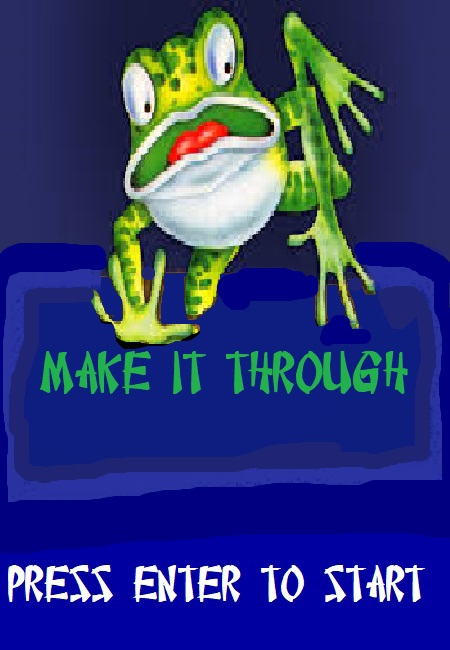
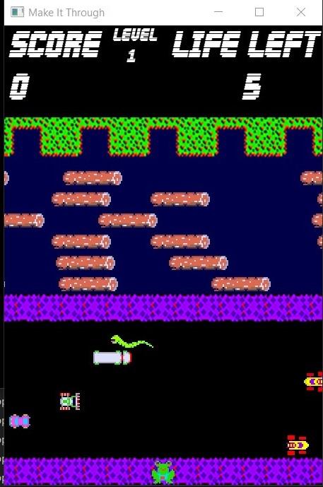
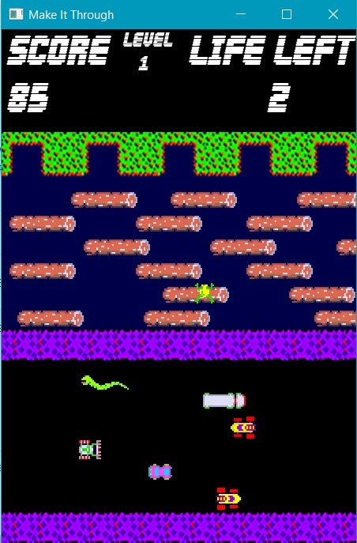
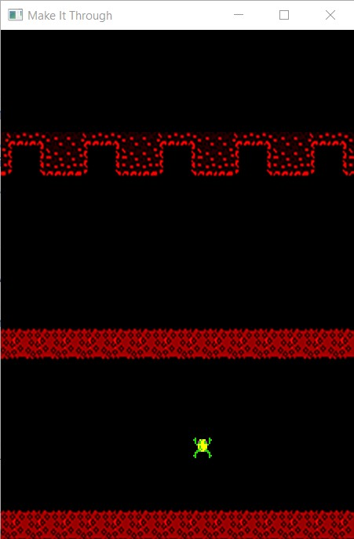
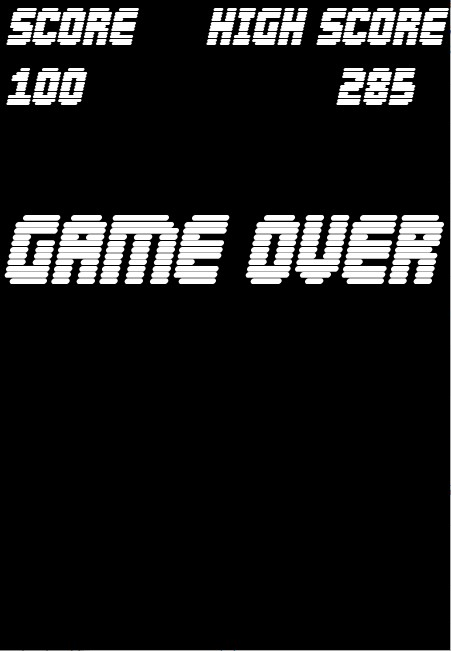

# Make it through
## This game is a classic frogger game made using C++.
## For graphics and user interface SFML is used.

## Screenshots of the game
|  |
|:--:| 
| *Home Screen* |
|  |
|:--:| 
| *Gameplay* |
|  |
|:--:| 
| *Gameplay* |
|  |
|:--:| 
| *Accident* |
|  |
|:--:| 
| *Game Over* |

## How to run?
- **Clone the repository** ```git clone https://github.com/shrijak/make-it-through/```
- **Run** ```make it through.exe```
- **Press Enter to start the game**
